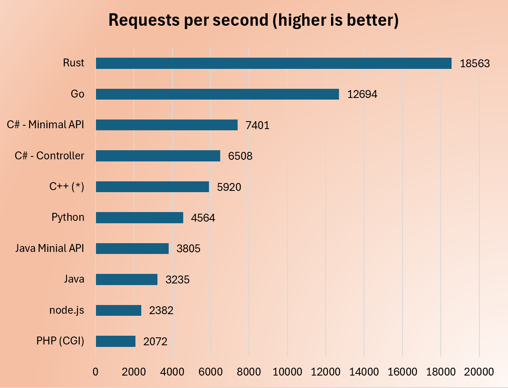

# Multi Dev Language User Token API Comparison

**July the 30th, 2025**

This repository contains eight identical user authentication APIs implemented in different programming languages, along with comprehensive performance testing tools. The project demonstrates performance characteristics across C# .NET Core, Node.js, Rust, PHP, Python, Java, C++, and Go implementations.

# Context

This test have been created for two main purposes:
1. **Performance Benchmarking**: To compare the performance of different programming languages and frameworks in the context of simple API call and database interaction.
**We do not evaluate complex compute scenarios**.
2. **Code readability and maintainability**: To compare the code readability and maintainability across multiple languages.

All have been build with AI Claude Sonnet 4, reveiwed and improved by human developers.
Note : Claude Sonnet 4 didn't succeed to build the C++ API, I had to fix it manually.
Note 2 : Today choosing C++ for web development is not a good idea. I did it to compare with Rust, which is the "new" C++.

## 📊 Performance Benchmarks

Based on testing with 100,000 requests and 16 concurrent connections
On an AMD Ryzen 7 2700X, 8 core, 16 logical threads - Windows 10 machine.

```
Rust 17887 req/s
Go 12049 req/s
C# 7417 req/s
C++ 5652 req/s (see remarks below)
Java 4526 req/s
Node.js 2076 req/s
Python 1935 req/s
PHP 1227 req/s
```



=> Conclusion : Today if you need performance don't use interpreted code.

## 🔍 Performance Analysis

### 🥇 Top Performers (Compiled Languages)
- **Rust**: Compiled to native code with zero-cost abstractions - **fastest overall**
- **Go**: Compiled to native code with efficient runtime and goroutines - **excellent balance of performance and simplicity**
- **C#/.NET Core**: Compiled to native code with managed runtime - **strong enterprise performance**

### 🥈 Mid-Tier Performance
- **C++**: Native compilation with minimal overhead, but **not recommended for web development**
  - *Note*: Difficult and verbose for poor HTTP performance. Better to use a C++ wrapper from Rust, Go or C#.
  - *Today's choice*: Rust is the superior "new C++" for systems programming
- **Java**: JVM with JIT compilation - **good performance through runtime optimizations**

### 🥉 Interpreted/Dynamic Languages
- **Node.js**: V8 JavaScript engine - **decent async performance**
- **Python**: FastAPI/Uvicorn shows **good async capabilities** despite being interpreted
- **PHP**: Traditional interpreted approach - **adequate for standard web apps**

Have a look at file result.txt for complete results.

## 📡 API Endpoints

All eight implementations expose identical REST endpoints:

### Health Check
```http
GET /health
```
Returns: `"UserTokenApi [Language] server is running"`

### User Authentication
```http
POST /api/auth/get-user-token
Content-Type: application/json

{
  "username": "user@example.com",
  "hashedPassword": "sha256_hash_here"
}
```

### Response Format
```json
{
  "success": true,
  "userId": 1,
  "errorMessage": null
}
```

### Database Setup
```http
POST /setup-database/{count}
```
Creates test users in the database (e.g., `/setup-database/10000`)

## 🛠️ Quick Start Commands

### Running the APIs

#### .NET API
```bash
cd dotnet/UserTokenApi
dotnet run
# Runs on http://localhost:5150
```

#### Node.js API
```bash
cd nodejs
npm install
node index.js
# Runs on http://localhost:3000
```

#### Rust API
```bash
cd rust/user-token-api
cargo run
# Runs on http://localhost:8080
```

#### PHP API
```bash
cd php
php -S localhost:9000 index.php
# Runs on http://localhost:9000
```

#### Python API
```bash
cd python
pip install -r requirements.txt
uvicorn main:app --host 0.0.0.0 --port 7000 --workers 16 
# Runs on http://localhost:7000
```

#### Java API
```bash
cd java
mvn spring-boot:run
# Runs on http://localhost:6000
```

#### C++ API
```bash
cd cpp
vcpkg install
# Build with your preferred method (Visual Studio, CMake, etc.)
./cpp  # or cpp.exe on Windows
# Runs on http://localhost:8081
```

#### Go API
```bash
cd go
go mod tidy
go run main.go
# Runs on http://localhost:8082
```

### VS Code Tasks
Use `Ctrl+Shift+P` → "Tasks: Run Task" and select:
- **Run UserTokenApi** - Start .NET API
- **Run Node.js UserTokenApi** - Start Node.js API  
- **Run Rust UserTokenApi** - Start Rust API
- **Run PHP UserTokenApi** - Start PHP API
- **Run Python UserTokenApi** - Start Python API
- **Run Java UserTokenApi** - Start Java API
- **Run C++ UserTokenApi** - Start C++ API
- **Run Go UserTokenApi** - Start Go API
- **Run C# Load Tester** - Execute performance tests
- **Build Rust UserTokenApi** - Compile Rust project

## 🔥 Performance Testing

### C# Load Tester (Recommended)
Enterprise-grade load testing with detailed metrics:

```bash
cd dotnet_test/ApiLoadTester
dotnet run [requests] [concurrency]

# Examples:
dotnet run                    # Default: 10,000 requests, 16 concurrent
dotnet run 1000 8            # 1,000 requests, 8 concurrent
dotnet run 50000 32          # 50,000 requests, 32 concurrent
```

**Features:**
- Tests all eight APIs automatically
- Connection pooling optimization
- Detailed percentile analysis (50th, 95th, 99th)
- Request/response validation
- Concurrent request management with SemaphoreSlim

## 🚦 Getting Started

**Start all APIs:**
   ```bash
   # Terminal 1 - .NET
   cd dotnet/UserTokenApi && dotnet run
   
   # Terminal 2 - Node.js  
   cd nodejs && npm install && node index.js
   
   # Terminal 3 - Rust
   cd rust/user-token-api && cargo run
   
   # Terminal 4 - PHP
   cd php && php -S localhost:9000 index.php
   
   # Terminal 5 - Python
   cd python && pip install -r requirements.txt && uvicorn main:app --port 7000 --workers 16
   
   # Terminal 6 - Java
   cd java && mvn spring-boot:run
   
   # Terminal 7 - C++
   cd cpp && vcpkg install && ./cpp
   
   # Terminal 8 - Go
   cd go && go mod tidy && go run main.go
   ```

## 📝 License

This project is for educational and benchmarking purposes.
